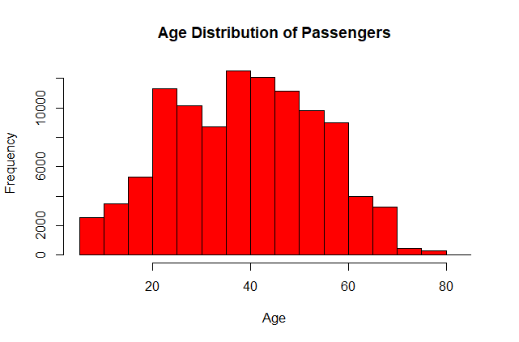
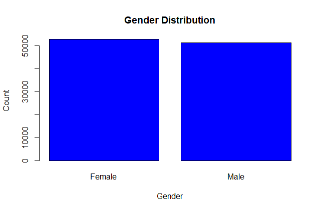
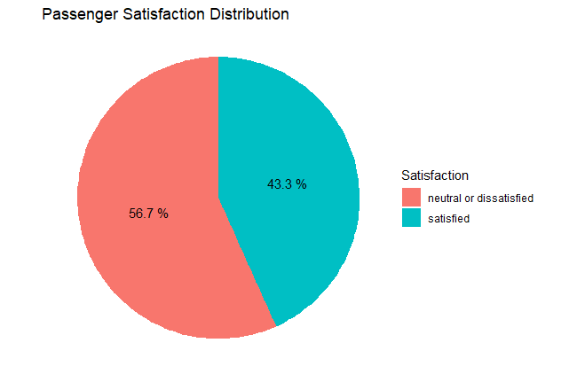

# Passenger Satisfaction Analysis

## Overview
This project conducts a detailed analysis of airline passenger satisfaction. The aim is to uncover underlying patterns and factors that contribute to passengers' satisfaction levels. The study utilizes various data visualization and machine learning techniques to understand and predict satisfaction outcomes.

## Dataset
The analysis is based on a dataset that includes numerous features such as age, gender, type of travel, service ratings, and many others. This dataset has been divided into training and test sets for the purpose of model training and evaluation.

## Analysis Workflow
1. **Load Libraries** - Essential R libraries like `rpart`, `rpart.plot`, `klaR`, and `caret` are loaded to perform various statistical and machine learning tasks.
2. **Prepare Data** - The data is read from CSV files and prepared for analysis. Satisfaction feature is converted to a factor to suit the classification models.
3. **Data Visualizations** - Various visualizations are generated:
   - Pie Chart for Passenger Satisfaction Distribution
   - Histogram for Age Distribution of Passengers
   - Bar Plot for Gender Distribution
   - Box Plot for Flight Distance by Satisfaction

4. **Model Building and Evaluation** - Two predictive models are created:
   - A Decision Tree model to classify the satisfaction based on all available features.
   - A Naive Bayes model that focuses on online boarding, inflight wifi service, and type of travel as predictors of satisfaction.

5. **Results** - The performance of both models is evaluated using confusion matrices, and their accuracies, sensitivities, and specificities are reported.

## Technologies Used
- R and RStudio
- R packages: `rpart`, `rpart.plot`, `klaR`, `caret`, `ggplot2`

## How to Use
1. Clone this repository to your local machine.
2. Open the R script `flight_satisfaction.R` to view the analysis.
3. Run the script in RStudio to reproduce the analysis and visualizations.

## Visualizations
Below are some key visualizations from the project:

*Passenger Satisfaction Distribution*

*Age Distribution of Passengers*

*Gender Distribution*

*Flight Distance by Satisfaction*

## Conclusion
This project demonstrates the application of data science in understanding customer satisfaction. The insights derived from this analysis could be instrumental for airlines looking to enhance their customer service and overall satisfaction levels.

